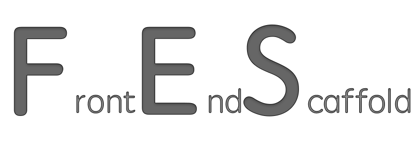

**fes(front end scaffold)**，发音：/fes/。它是基于 webpack4、koa2 搭建的多页面开发环境。高效开发，快速打包。

**create-fes** 是一个构建多页面应用的命令，灵感来源于[create-react-app](https://github.com/facebook/create-react-app)。

[English Readme](./README_EN.md)

## 安装
```js
npm install create-fes -g
```
如果不想安装`create-fes`，可以直接使用`npx`命令(推荐)
```js
npx create-fes <project-name>
```
## 使用
- 默认
```js
create-fes example
```
- `-B, --no-babel` 表示是否关闭`babel`。

```js
create-fes example -B
// or
create-fes example --no-babel
```
- `-t, --typescript` 表示是否开启`typeScript`。

```js
create-fes example -t
// or
create-fes example --typescript
```
- `-n, --npm` 表示直接使用 `npm` 安装依赖包。
```js
create-fes example -n
// or
create-fes example --npm
```
- `--scripts-version <alternative-package>` 表示使用一个自定义 `fes-scripts` 版本。

```js
create-fes example --scripts-version 1.0.x
```

- `-h, --help` 表示获取帮助信息。

```js
create-fes example -h
// or
create-fes example --help
```
## 自定义模板
在使用`create-fes`命令创建 fes-app 过程中，会提供模板选择功能:
```
What template do you need?
pc
other custom template(<path-to-template>)
```
选择`other custom template(<path-to-template>)`选项，提示
```
Please input a valid path of template?
$ /path/to/your/template #输入模板绝对路径
```


## 项目目录结构

```css
├── .babelrc ---> babel配置文件
├── .browserslistrc ---> browserslist 配置文件。postcss、babel 会根据其配置进行编译。更多参考：https://github.com/browserslist/browserslist
├── tsconfig.js ---> typeScript配置文件
├── README.MD
├── package.json
├── app.config.js ---> 定制文件
├── build ---> 打包文件夹
├── config ---> 配置文件夹
├── public ---> 公用资源
└── src ---> 源代码文件夹
```
### config 配置文件夹
如果`app.config.js`提供的配置项不能满足你的项目需要，可以通过`webpack.dev.config.js`和`webpack.prod.config.js`进行重写定制。
```js
├── webpack.dev.config.js
└── webpack.prod.config.js
```

### src 文件夹

```js
├── api --->使用mockjs模拟api
├── assets --->资源文件
├── javascripts --->js源代码文件夹: 根据该目录下直接js文件生成entry
├── mock --->mock数据，支持js、json格式，及多文件数据(index.1.json, index.2.json.....)。其中`common`是公用 mock 数据
├── styles --->scss源代码文件夹
└── views --->twig源代码文件夹: 根据该目录下直接twig文件来生成页面，即页面需要与twig文件保持一致
```

### 配置

`app.config.js`提供如下配置项：

- babelLoader：配置babel-loader，默认为`{}`。[详细配置参考……](https://github.com/2createStudio/postcss-sprites)

- isHot：是否开启热加载，默认为`true`。只在开发模式下有效。
- cssModules：配置css modules，默认为`{}`。[详细配置参考……](https://github.com/css-modules/postcss-modules)
- sw：service worker 配置，默认为`{}`。[详细配置参考……](https://developers.google.com/web/tools/workbox/modules/workbox-webpack-plugin)
- proxy：配置 proxy。[详细配置参考……](https://github.com/chimurai/http-proxy-middleware)
- provide：自动加载模块配置，默认为`{}`。[详细配置参考……](https://webpack.js.org/plugins/provide-plugin/)
- spritesConfig：配置 sprites。[详细配置参考……](https://github.com/2createStudio/postcss-sprites)
- urlLoader：配置url-loader。[详细配置参考……](https://github.com/webpack-contrib/url-loader)
- extraDedenpencies：增加依赖文件，方便开发修改时，能自动编译。相对于 'src' 目录，支持 `'**/*.js'` 形式。[详细配置参考……](https://github.com/isaacs/node-glob)
- tsChecker：fork-ts-checker-webpack-plugin 配置设置，默认为`{}`。[详细配置参考……](https://github.com/Realytics/fork-ts-checker-webpack-plugin#readme)
- alias：alias配置项。
- sourceMap：是否开启 sourceMap，默认为`true`。
- devtool：配置 devtool。[详细配置参考……](https://webpack.js.org/configuration/devtool/#root)
- routerConfig：路由配置项，可以自定义页面的路由映射。
  ```js
  // 重新定义不会启动默认配置。即需要指定项目所有的页面路由
  '/your/path': 'index.html'
  ```

- dev：开发模式
  - port：端口号，默认为`3000`
  - autoOpen：是否浏览器自动打开，默认为`true`
  - qrcode：是否生成预览二维码，默认为`true`
- build：生成模式
  - publicPath：输出路径，默认为'/'
  - outputPath：配置资料文件输出路径。支持字符串或对象，字符串表示path。如果想精细定制，可以使用对象形式：`{path, filename, chunk(仅js有效)}`

        - css：css 输出路径
        - others：除了 css、img、js 文件外的资源输出路径
        - img：img 输出路径
        - js：js 输出路径
        `{
          path: 'static/css/',
          filename: '[name].[chunkhash:8].js',
          chunck: '[name].[chunkhash:8].chunk.js',
        }`

  - report：是否开启打包分析报告，默认为`false`
  - isTmpl：是否输出模板，默认为`false`

- tmpl：开发模式，**注意：该模式只能在`isTmpl: true`生效**
  - port：端口号，默认为`3100`
  - autoOpen：是否浏览器自动打开，默认为`true`
  - qrcode：是否生成预览二维码，默认为`true`
- preview：开发模式
  - port：端口号，默认为`3030`
  - autoOpen：是否浏览器自动打开，默认为`true`
  - qrcode：是否生成预览二维码，默认为`true`

### 项目使用

- 安装依赖包

```js
npm install
```

- 开发

```js
npm start
```

- 打包

```js
npm run build
```

- 预览

```js
npm run preview
```

- 模板输出预览

```js
npm run tmpl
```

### css modules
_注意：默认开启 `global` 模式，要使用需要主动声明 `local`_

- scss

```scss
/* 文件名为：_cssm.scss */
:local(.cnt){
  position: fixed;
  left: 0;
  top: 30%;
  background-color: rgba(54, 54, 54, 0.486);
  box-shadow: 1px 1px 0.2rem rgba(2, 2, 2, 0.568);
  :local(.tt){
    font-size: 1rem;
    color: rgb(133, 233, 150);
  }
  :local(.des){
    background-color: rgb(19, 19, 19);
    color: #fff;
  }
}
```
- html
```html
<!-- 引用以文件名为引用对象: cssm -->
<div class="{{ cssm.cnt }}">
  <h3 class="{{ cssm.tt }}">css-module</h3>
  <p class="{{ cssm.des }}">介绍fes中css-modules的使用</p>
</div>
```
### 引用图片的方式

_注意：图片的引用必须相对于入口页面_

html：相对路径是相对入口 html 文件引用

```html
<!-- 直接引用 -->

<!-- 嵌入方式 -->
<div style="background-image: url('${require(`../assets/puppy.jpg`)}')">
```

html：绝对路径引用

```html
<!-- alias: @:/Users/singsong/github/fes/src -->

<div style="background-image: url('${require(`@/assets/puppy.jpg`)}')">
```

scss：相对路径是相对入口的 scss 文件引用

```scss
.icons {
  background-image: url(../assets/husky.jpg);
  position: relative;
  padding: 10px 40px;
  overflow: hidden;
  background-color: #cbce08;
  .ant {
    float: left;
    background: url(../assets/sprite/ant1.png) no-repeat 0 0;
    height: 64px;
    width: 64px;
    &:hover {
      background-image: url(../assets/sprite/ant2.png);
      transform: scale(1.2);
    }
  }
}
```

scss：绝对路径引用

```scss
// alias: @:/Users/singsong/github/fes/src
.icons {
  background-image: url(~@/assets/husky.jpg);
  position: relative;
  padding: 10px 40px;
  overflow: hidden;
  background-color: #cbce08;
  .ant {
    float: left;
    background: url(~@/assets/sprite/ant1.png) no-repeat 0 0;
    height: 64px;
    width: 64px;
    &:hover {
      background-image: url(~@/assets/sprite/ant2.png);
      transform: scale(1.2);
    }
  }
}
```

### 注意事项

可以开启`css modules`，不过它更适合与 js 混合开发模式，如css-in-js、react、vue 开发。

- [CSS modules break build if used with `~`](https://github.com/webpack-contrib/css-loader/issues/589#issuecomment-365942989)
- [@imports not resolving when css-modules enabled ](https://github.com/webpack-contrib/css-loader/issues/436)
- [CSS Modules & Sass in Create React App](https://medium.com/@kswanie21/css-modules-sass-in-create-react-app-37c3152de9)

## TODO-LIST

- 支持其他常用的模板引擎，同时增加对应的模板。
- 完善文档，增加 examples
- 完善英文文档
